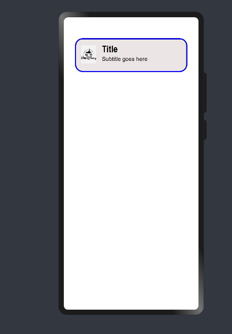
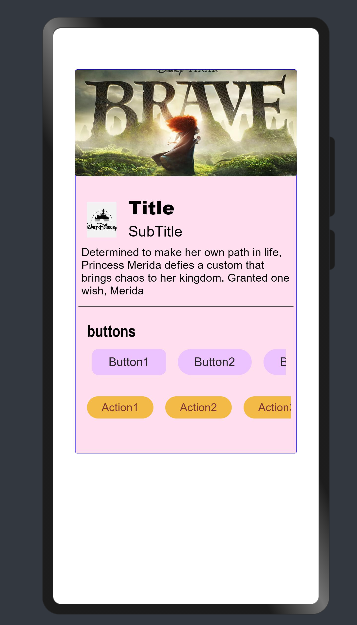
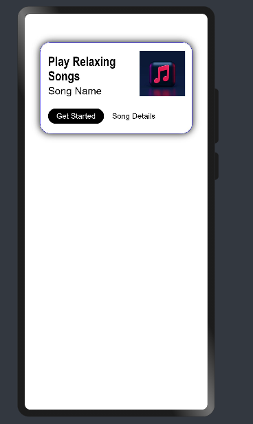
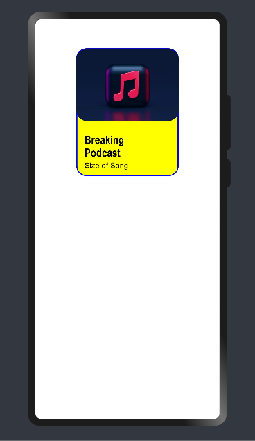
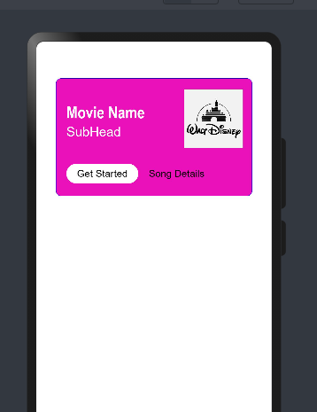

# Material_Cards

Material Card Design. This library can be used to create 3 different types of cards implemented using extended typescript.

Three cards :

1. Filled Card (Default)
2. Outlined Card
3. Elevated Card

# Instructions for use


1. You need to import the following:

```ets
import {button,CardModel,CardType,MediaIconPosition,MaterialCard} from '@ohos/material-card'
```
2. Initialize CardModel model data

```ets
private model : CardModel =new CardModel('Title' , 'Subtitle')
```
3. Code for creating a basic Outlined Card. Set the Card Parameters based on the requirement.
```ets
 private subHead : CardModel = new CardModel('Title' , 'Subtitle')
```
Call the corresponding function of the Model

```ets
 this.subHead.setCardHeight(90)
 this.subHead.setCardWidth(300)
 this.subHead.setCardType(CardType.Outlined)
 this.subHead.setCardBorderWidth(3)
 this.subHead.setLeadingIcon($r('app.media.disneylogo'))
 this.subHead.setCardBackGroundColor('#ffece5e5')
 this.subHead.setLeadingIconHeight(64)
 this.subHead.setLeadingIconWidth(64)
```
Note : To change the Type of the Card, change cardType. Default is set as 'Normal' i.e., Filled Card.



#Filled_Card

Code for Complete Filled Card. Set/Change the card default Parameters based on the requirement. 

```ets

private model: CardModel =new CardModel('Title' , 'subTitle')

aboutToAppear(){
    this.model.setCardBackGroundColor('#ffffdef0')
    this.model.setCardType(CardType.Normal)
    this.model.setLeadingIcon($r('app.media.disneylogo'))
    this.model.setMediaIcon($r('app.media.brave'))
    this.model.setCardHeight(520)
    this.model.setShowDivider(true)
    this.model.setButtonHeader('Show Timings')
    this.model.setSupportingText("Determined to make her own path in life, Princess Merida defies " +
                                    "a custom that brings chaos to her kingdom. Granted one wish, Merida ")
    this.model.setShadowColor('#d0fa7fff')
    this.model.setShadowRadius(40)
    this.model.setBorderRadius(3)
    this.model.setMediaIconPosition(MediaIconPosition.Top)
    this.model.setSubTitleFontSize(20)
    this.model.setTitleFontSize(25)
    this.model.setTitleFontWeight(FontWeight.Bolder)
    this.model.setButtons([new button.Model('Button1',false, '#ff242222', '#ffecc2ff', 15, ButtonType.Normal, 35, 100),
                            new button.Model('Button2',false, '#ff242222', '#ffecc2ff', 15, ButtonType.Capsule, 35, 100),
                            new button.Model('Button3',false, '#ff242222', '#ffecc2ff', 15, ButtonType.Capsule, 35, 100),
                            new button.Model('Button4',false, '#ff242222', '#ffecc2ff', 15, ButtonType.Capsule, 35, 100),
                            new button.Model('Button5',false, '#ff242222', '#ffecc2ff', 15, ButtonType.Capsule, 35, 100)])
    this.model.setActions([new button.Model('Action1',false, '#ff7e3636', '#fff3bb45', 15, ButtonType.Capsule, 30, 90),
                            new button.Model('Action2',false, '#ff7e3636', '#fff3bb45', 15, ButtonType.Capsule, 30, 90),
                            new button.Model('Action3',false, '#ff7e3636', '#fff3bb45', 15, ButtonType.Capsule, 30, 90),
                            new button.Model('Action4',false, '#ff7e3636', '#fff3bb45', 15, ButtonType.Capsule, 30, 90),
                            new button.Model('Action5',false, '#ff7e3636', '#fff3bb45', 15, ButtonType.Capsule, 30, 90),])
}
build() {
    Column() {
        MaterialCard({
            model : this.model
        })
    }.width('100%')
}
```


Button can be added to the Card in the form an array. Passing Parameter layout is given below:

Note : 'isText'  is a boolean, if set 'true' the, button is in the form of only Text. 'false' will set it as 
```ets
    button1 : button.Model = new this.button.Model(buttonText,isText,fontColor,buttonColor,fontSize,ButtonType,buttonHeight,buttonWidth)
```
Note: To change the position of the  Media Icon Image, change MediaIconPosition. Default is set as 'Middle'. 
```ets
this.model.setMediaIconPosition(MediaIconPosition.Top) 
```
All the Variables can be reset to their default values by call reset function.
```ets
this.model.reset()
```
#Elevated_Card 
```c
private rightImageModel : CardModel = new CardModel('Play Relaxing Songs', 'Song Name')

aboutToAppear() {
    this.rightImageModel.setMediaIconPosition(MediaIconPosition.Right)
    this.rightImageModel.setCardType(CardType.Elevated)
    this.rightImageModel.setCardHeight(180)
    this.rightImageModel.setCardWidth(300)
    this.rightImageModel.setMediaIconWidth(90)
    this.rightImageModel.setMediaIconHeight(90)
    this.rightImageModel.setMediaIcon($r('app.media.music'))
    this.rightImageModel.setShadowColor(Color.Black)
    this.rightImageModel.setShadowRadius(35)
    this.rightImageModel.setSubTitleFontSize(20)
    this.rightImageModel.setSubTitleFontWeight(FontWeight.Medium)
    this.rightImageModel.setActions([new button.Model('Get Started', false, Color.White, Color.Black, 15, ButtonType.Capsule,30, 110),
                                        new button.Model('Song Details', true, Color.Black, Color.Green, 15, ButtonType.Capsule, 30, 110)])
}
build() {
    Column() {
        MaterialCard({
            model : this.rightImageModel
        })
    }.width('100%')
}
```


#Few More Examples

#Outlined_Card
```ets
  private album : CardModel = new CardModel('Breaking Podcast', 'Size of Song')
  aboutToAppear(){
    this.album.setMediaIconPosition(MediaIconPosition.Top)
    this.album.setCardType(CardType.Outlined)
    this.album.setCardHeight(250)
    this.album.setCardWidth(200)
    this.album.setMediaIconWidth(200)
    this.album.setMediaIconHeight(180)
    this.album.setMediaIcon($r('app.media.music'))
    this.album.setMediaIconHeight(140)
    this.album.setTitleFontSize(22)
    this.album.setCardBackGroundColor(Color.Yellow)}
}   
build(){
    Column(){
        MaterialCard({
        model : this.rightImage
        })
}
}
```


#Filled_Right_image_Card

```ets
  private filledCard : CardModel = new CardModel('Movie Name','SubHead')

``aboutToAppear() {
    this.filledCard.setMediaIconPosition(MediaIconPosition.Right)
    this.filledCard.setCardHeight(180)
    this.filledCard.setCardWidth(300)
    this.filledCard.setMediaIconWidth(90)
    this.filledCard.setMediaIconHeight(90)
    this.filledCard.setMediaIcon($r('app.media.disneylogo'))
    this.filledCard.setSubTitleFontSize(20)
    this.filledCard.setSubTitleFontWeight(FontWeight.Medium)
    this.filledCard.setActions([new button.Model('Get Started', false, Color.Black, Color.White, 15, ButtonType.Capsule,30, 110),
    new button.Model('Song Details', true, Color.Black, Color.Green, 15, ButtonType.Capsule, 30, 110)])
    this.filledCard.setBorderRadius(8)
    this.filledCard.setTitleFontColor(Color.White)
    this.filledCard.setSubTitleFontColor(Color.White)
    this.filledCard.setCardBackGroundColor('#ffea11bb')
}

build(){
    Column(){
        MaterialCard({
            model = this.filledCard
        })  
    }.width('100%')
}
```



##Compatability

Supports OpenHarmony API version 8

##Open Source License

Licensed under Apache-2.0 license

##Reference:

Design by : Chaitanya P.